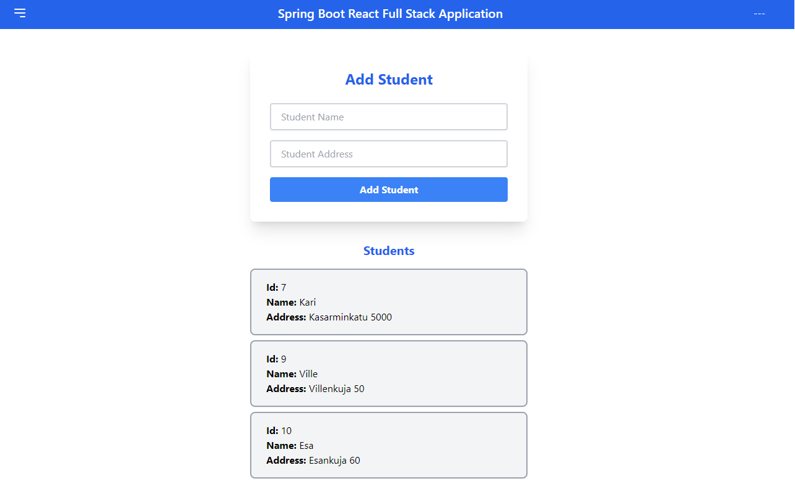

# Website for adding student to list with Java spring boot, MySql, vite, React.js and tailwind.css

## Available Scripts

In frontend directory run:

### "Npm install"
Installs all the dependencies

### "Npm run dev" 
Runs the application in development mode
Open it on http://localhost:5173/

### Starting backend

Open backend folder and run the main function. Also you need to have Apache and Mysql running.
I used Xampp control panel for this.

## Screenshot

Here is picture of the app

